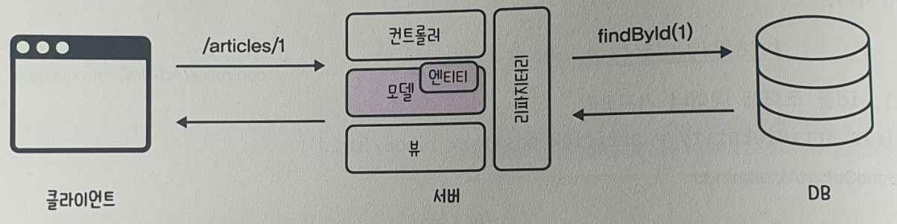

springBoot
=
### 1. JavaStudy Day 01 (스프링부트 시작하기)

1. 자바설치(windows 버전별 설치가능 17 - LTS버전) :
      https://adoptium.net/temurin/releases/
   * java -version 콘솔에서 자바 버전 확인</br></br>
2. 스프링 부트 프로젝트 만들기 : https://start.spring.io/ </br>
   </img>
   </br></br>
3. helloworld 출력하기</br>
   </img>
   </br></br>
----------------
### 2. JavaStudy Day 02 (뷰 템플릿과 MVC패턴)
1. Model(모델) : 데이터 관리역활 </br>
2. View Template(뷰) : 화면 담당 (스프링 프로젝트에서 <b>Mustache 뷰 템플릿 엔진 사용</b>)</br>
   > 디렉토리 위치 : src> main> resource> templates (.mustache 파일이 위치)

3. Controller(컨트롤러) : 클라이언트의 요청을 서버에서 처리하는 역활 </br>
   > 디렉토리 위치 : src> main> java > project name package > controller </br> 
     (일반적인 컨트롤러 이름은 XxxController 라고 명명함)
   
4. Handlebars/Mustache 플러그인 설치 </br>
   </img>
   </br></br>
5. Controller </br>
   * controller/FirstController.java </br>
       ```java
      @Controller  // 컨트롤러 선언(annotaion-어노테이션 일종의 메타데이터)
       public class FirstController {
           @GetMapping("hi") // URL 맵핑(요청, 접수)
           public String niceToMeetYou(Model model) { // 모델 객체 가져오기 / 메서트 수행
               model.addAttribute("username","jang"); // 모델변수 등록 "변수명","변수값"
               return "greetings"; // 뷰 템플릿 반환
           }
   
           @GetMapping("/bye")
           public String seeYouNext(Model model) {
               model.addAttribute("nickname","홍길동");
           return "goodbye";
           }   
   
       }
       ```
6. BootStrap
    * 페이지 헤더 / Navbar 소스 Copy: https://getbootstrap.com
    * contents </br>
      </img>
      </br>
    * Navbar
      </img>
      </br></br>

7. View Templete </br>
    * resources/templates/layouts/header.mustache </br>
      ```html
      <!doctype html>
      <html lang="en">
         <head>
         <!-- Required meta tags -->
         <meta charset="utf-8">
         <meta name="viewport" content="width=device-width, initial-scale=1">
         (중략)
      ``` 
   * resources/templates/layouts/footer.mustache </br>
     ```html
        <!-- site info -->
        <div class="mb-5 container-fluid">
        <hr>
        <p>ⓒ CloudStudying | <a href="#">Privacy</a> | <a href="#">Terms</a></p>
        </div>
        (중략)
     ```       
   * resources/templates/greetings.mustache </br>
       ```html
       {{>layouts/header}}
       <!-- content -->
       <div class="bg-dark text-white p-5">
           <h1>{{username}}님, 반갑습니다!</h1>
       </div>
       {{>layouts/footer}}
       ```
   * resources/templates/goodbye.mustache </br>
       ```html
       {{>layouts/header}}
       <div class="bg-dark text-white p-5">
           <h1>{{username}}님, 다음에 또 만나요!</h1>
       </div>
       {{>layouts/footer}}
       ```
8. 셀프체크 </br>
    * resources/templates/quote.mustache </br>
      ```html
      {{>layouts/header}}
      <div class="bg-dark text-white p-5">
        <h1>{{randomQuote}}</h1>
      </div>
      {{>layouts/footer}}

      ```      
   * controller/SecondController.java </br>
       ```java
       @Controller
       public class SecondController {
            @GetMapping("/random-quote")
            public String randomQuote(Model model) {
                String[] quotes = {
                "행복은 습관이다. 그것을 몸에 지니라. " +
                        "-허버드-",
                "고개 숙이지 마십시오. 세상을 똑바로 정면으로 " +
                        "바라보십시오. -헬렌 켈러-",
                "고난의 시기에 동요하지 않는 것, 이것은 진정 " +
                        "칭찬받을 만한 뛰어난 인물의 증거다. -베토벤-",
                "당신이 할 수 있다고 믿든 할 수 없다고 믿든, 믿는 " +
                        "대로 될 것이다. -헨리 포드-",
                "작은 기회로부터 종종 위대한 업적이 시작된다. " +
                        "-데모스테네스-"
                };
                int randInt = (int) (Math.random() * quotes.length);
                model.addAttribute("randomQuote", quotes[randInt]);
                return "quote";
            }
      }
       ```

> Day 02 정리
>1. 뷰 템플릿 : 웹페이지를 하나의 틀로 만들고 여기에 변수를 삽입해서 서로 다른 페이지를 보여주는 기술 </br></br> 
>2. MVC 패턴
>   * Model : 데이터 관리
>   * View : 웹페이지를 화면에 보여줌
>   * Controller : 클라이언트의 요청을 서버에서 처리 </br></br>
>3. 뷰 템플릿 생성위치 
>   * src> main> resource> templates (.mustache 확장자 파일이 위치) </br></br>
>4. 컨트롤러 생성위치
>   * src> main> java > 기본 패키지 안에 컨트롤러 패키지를 만든 후 자바 클래스 파일을 생성(확장자는 .java) </br></br>
>5. 모델을 통해 변수를 등록하는 방법
>   * 모델은 컨트롤러의 메서드에서 매개변수로 받아옴
>   * model.<b><u>addAttribute</u></b>("변수명","변수값") : addAttribute 메서드 모델에서 변수 등록할때 사용 </br></br>
>6. 헤더-푸터 레이아웃
>   * header - 헤더 : 내비게이션 영역
>   * contents - 컨텐츠 : 핵심내용 영역
>   * footer - 푸터 : 사이트 정보등 </br></br>
>7. 부트스트랩
>   * 프론트엔드 개발을 빠르고 쉽게 할 수 있는 반응형 웹사이트의 프레임워크 </br></br>
>8. 레이아웃 템플릿 생성과 적용
>   * 레이아웃 템플릿을 삽입할 때는 원하는 위치에서 {{>파일경로/파일명}} 형식으로 작성 </br></br>

----------------
### 3. JavaStudy Day 03 (CRUD)
1. 폼 < form > 태그에 실어 보낸 데이터를 서버의 컨트롤러가 객체(DTO : Data Transfer Object)에 담음 </br></br>
2. 입력폼 만들기
   * resources/templates/articles/new.mustache </br>
     ```html
     {{>layouts/header}}
     <form class="container" action="/articles/create" method="post">
         <div class="mb-3">
             <label class="form-label">제목</label>
             <input type="text" class="form-control" name="title">
         </div>
         <div class="mb-3">
             <label class="form-label">내용</label>
             <textarea class="form-control" rows="3" name="content"></textarea>
         </div>
        <button type="submit" class="btn btn-primary">Submit</button>
     </form>
     {{>layouts/footer}}
     ``` 
3. 컨트롤러 만들기
    * controller/ArticlesController.java </br>
       ```java
      @Controller
      public class ArticleController {
      
            @Autowired // 스프링 부트가 미리 생성해 놓은 리파지터리 객체 주입
            private ArticleRepository articleRepository;  // articleRepository 객체 선언
      
            @GetMapping("/articles/new")
            public String newArticleForm(){
                return "articles/new";
            }

            @PostMapping("/articles/create") // post방식 데이터 전송 맵핑
            public String createArticlesForm(ArticleForm form){ // 메서드 생성 및 반환값 작성 / ArticleForm form : 폼데이터를 DTO로 받기
                System.out.println(form.toString()); // 폼데이터가 잘 담겼는지 출력하여 확인
                // 결과 : ArticleForm{title='제목', content='내용내용내용'}

                // 1. DTO를 entity(엔티티)로 변환
                Article article = form.toEntity(); // toEntity() from객체를 엔티티 객체로 변환
                System.out.println(article.toString()); // DTO가 엔티티로 잘 변환되는지 출력
                // 결과 : Article{id=null, title='제목', content='내용내용내용'}

                // 2. repository(레파지터리)로 entity(엔티티)를 저장
                Article saved = articleRepository.save(article); // article 엔티티를 저장해 saved 객체에 반환
                System.out.println(saved.toString()); // article이 DB에 잘 저장되는지 출력
                // 결과 Article{id=1, title='제목', content='내용내용내용'}

            return "";
            }
      
      }

       ```

4. DTO 만들기
   * DTO : 데이터를 전달하기 위한 객체
   * dto/Articles.java </br>
      ```java

     public class ArticleForm { // DTO(data Transfer Object)폼데이터를 받아 담는 그릇
        private String title; // 제목받는 필드
        private String content; // 내용 받는 필드

        // Constructor
        public ArticleForm(String title, String content) { // 전송받은 제목과 내용 저장 하는 생성자
             this.title = title;
            this.content = content;
        }

        // toString()
        @Override
        public String toString() { // 데이터를 잘 받았는지 확인할 메서드
            // 출력 결과 ArticleForm{title='제목', content='내용내용내용'}
            return "ArticleForm{" +
                    "title='" + title + '\'' +
                    ", content='" + content + '\'' +
                    '}';
        }

        public Article toEntity() { // DTO객체를 엔티티로 반환
             return new Article(null, title, content);
        }
     }     
     

      ```

5. Entity 만들기
    * entity(엔티티) : 실제 DB 테이블과 맵핑 되는 클래스 (자바 객체를 DB가 이해할 수 있게 만든 것으로, 이를 기반으로 테이블이 만들어짐) </br>
    * entity/Articles.java </br>
       ```java
      @Entity
      public class Article {
      @Id
      @GeneratedValue
      private Long id;

      @Column
      private String title;

      @Column
      private String content;

      // Article 생성자 추가
      public Article(Long id, String title, String content) {
        this.id = id;
        this.title = title;
        this.content = content;
      }

      // toString() 메서드 추가
      @Override
      public String toString() {
        return "Article{" +
                "id=" + id +
                ", title='" + title + '\'' +
                ", content='" + content + '\'' +
                '}';
        }
      }      

       ```
6. Repository 만들기
    * repository(리퍼지터리) : 엔티티가 DB 속 테이블에 저장 및 관리 될 수있게 하는 인터페이스  </br>
    * CrudRepository : JPA에서 제공하는 인터페이스로 이를 상속해 엔티티를 관리(CRUD) 할수 있다
    * repository/Articlerepository.java </br>
       ```java
       public interface ArticleRepository extends CrudRepository <Article, Long>{ // Article : 관리대상 엔티티의 클래스 타입, id : 관리대상 엔티티(Article.java)의 대표값 id 타입을 의미 즉 Long   

       }
       ```

7. 셀프체크 </br>
   * 뷰 : resources/templates/members/new.mustache </br>
     ```html
      {{>layouts/header}}
      <form class="container" action="/join" method="post">
          <div class="mb-3">
              <label class="form-label">이메일</label>
              <input type="email" class="form-control" name="email">
          </div>
          <div class="mb-3">
              <label class="form-label">비밀번호</label>
              <input type="password" class="form-control" name="password">
          </div>
          <button type="submit" class="btn btn-primary">Submit</button>
          <a href="/members">back</a>
      </form>
      {{>layouts/footer}} 
     ```      
   * 컨트롤러 : controller/MemberController.java </br>
       ```java
         @Controller
         public class MemberController {
            @Autowired // 스프링 부트가 미리 생성해 놓은 리파지터리 객체 주입
            private MemberRepository memberRepository;  // memberRepository 객체 선언
            @GetMapping("/members/new")
            public String newMembersForm(){
                return "members/new";
            }

            @PostMapping("/join") // post방식 데이터 전송경로 맵핑
            public String createMemberForm(MemberForm form){
                System.out.println(form.toString());
         
                Member member = form.toEntity();
                System.out.println(member.toString());
         
                Member saved = memberRepository.save(member);
                System.out.println(saved.toString());
     
                return "";
             }
         }
       ```

   * DTO : dto/MemberForm.java </br>
       ```java
        public class MemberForm { // DTO(data Transfer Object)폼데이터를 받아 담는 그릇
            private String email;
            private String password;

            // Constructor
            public MemberForm(String email, String password) { // 전송받은 제목과 내용 저장 하는 생성자
                this.email = email;
                this.password = password;
            }

            // toString()
            @Override
            public String toString() { // 데이터를 잘 받았는지 확인할 메서드

            return "MemberForm{" +
                "email='" + email + '\'' +
                ", password='" + password + '\'' +
                '}';
            }

            public Member toEntity() { // DTO객체를 엔티티로 반환
                return new Member(null, email, password);
            }
        }

       ```

   * 엔티티 : entity/Member.java </br>
       ```java
          @Entity
          public class Member {
            @Id
            @GeneratedValue
            private Long id;

            @Column
            private String email;

            @Column
            private String password;

            // Article 생성자 추가
            public Member(Long id, String email, String password) {
                this.id = id;
                this.email = email;
                this.password = password;
            }

            // toString() 메서드 추가
            @Override
            public String toString() {
                return "Member{" +
                        "id=" + id +
                        ", email='" + email + '\'' +
                        ", password='" + password + '\'' +
                        '}';
            }
          }     
       ```

   * 리퍼지토리 : repository/MemberRepository.java </br>
       ```java
          public interface MemberRepository extends CrudRepository <Member, Long>{

          }
       ```

> Day 03 정리
>1. DTO
>   * Data Transfer Object로 데이터를 전달하기 위한 객체
>   * 주로 View(클라이언트) 와 Controller(서버) 사이에서 사용
>   * 로직을 가지지 않는 순수한 데이터 객체(getter & setter 만 가진 클래스)
>   * <b>DTO는 데이터 전달만을 위한 객체가 핵심<b>이며 이외의 비지니스 로직은 굳이 들어갈 필요가 없음</br></br>
>2. 폼데이터를 DTO로 받는 과정 </br>
    </img> </br></br>
>3. JPA(Java Persistence API)
>   * 자바 언어로 DB에 명령을 내리게 하는 도구(데이터를 객체 지향적으로 관리하도록 도와줌)
>   * Entity : 자바 객체를 DB가 이해할 수 있게 만든것(<b>이를 기반으로 테이블이 만들어짐</b>)  
>   * Repository : 엔티티가 DB속 테이블에 CRUD(저장 및 관리) 할수 있게 하는 인터 페이스</br></br>
>4. DTO를 DB에 저장하는 과정 
>   DTO를 엔티티로 변환 후 리파지터리를 이용해 엔티티를 DB에 저장</br>
    </img> </br></br>
>5. 의존성 주입
>   * 외부에서 만들어진 객체를 필요한 곳으로 가져오는 기법(스프링 부트는 @Autowired 어노테이션을 사용) </br></br>

----------------
### 4. JavaStudy Day 04 (lombok)
> Day 04 정리
> 1. 록봄(lombok) : 코드를 간소화해주는 라이브 러리 </br>
     </img> </br>
>   * @AllArgsConstructor : 클래스 안쪽의 모든 필드를 매개변수로 하는 생성자를 만드는 어노테이션으로, 이를 사용하면 클랫 내에 별도의 생성자를 만들지 않아도 된다 </br></br>
>   * @ToString : toStrong() 메서드를 사용하는 효과와 동일, 별도의 toStrong() 메서드를 사용하지 않아도 된다. </br></br>
>   * @Slf4j : 로깅기능 사용 log.info(); 형식으로 사용한다 </br>
----------------
### 5. JavaStudy Day 05 (Read)
1. 데이터 조회 과정 </br>
   </img>
   </br></br>
2. 컨트롤러에 URL요청 </br>
   </img>
   </br></br>
3. 리파지터리로 데이터 가져오기 </br>
   </img>
   </br></br>
4. 모델에 데이터 등록하기 </br>
   </img>
   </br></br>
5. 뷰 페이지 반환하기 </br>
   </img>
   </br></br>
6. 데이터 조회 실습으로 본 MVC, JPA, DB의 상호작용 </br>
   </img>
   </br></br> 
7. 데이터 목록 조회하기 </br>
   </img>
   </br></br>
8. 소스코드
   * controller/ArticlesController.java </br>
       
      ```java
     @Slf4j
     @Controller
     public class ArticleController {
          @Autowired
          private ArticleRepository articleRepository;

          @GetMapping("/articles/new")
          public String newArticleForm() {
          return "articles/new";
          }

          @PostMapping("/articles/create")
          public String createArticle(ArticleForm form) {
            log.info(form.toString());
            // 1. DTO를 엔티티로 변환
            Article article = form.toEntity();
            log.info(article.toString());

            // 2. 리파지터리로 엔티티를 DB에 저장
            Article saved = articleRepository.save(article);
            log.info(saved.toString());
            return "";
          }

          @GetMapping("/articles/{id}") // 조회 데이터 URL 맵핑
          // show 메서드
          public String show(@PathVariable Long id, Model model) { // 매개변수로 id 받아오기
              // @PathVariable : URL요청으로 들어온 전달값을 컨트롤러의 매개변수로 가져오는 어노테이션
          
              // 1. id를 조회하여 데이터 가져오기
              Article articleEntity = articleRepository.findById(id).orElse(null);
              /*
              findById() : JPA의 CrudRepository가 제공하는 메서드로 특정 엔티티의 id값을 기준으로 데이터를 찾아 Optional 타입으로 반환
                           DB에 저장된 데이터를 id로 조회할때 findById()메서드를 사용
              orElse(null) : id값으로 데이터를 찾을 때 id값이 없을 경우 null을 반환                                        
              */

              // 2. 모델에 데이터 등록하기
              model.addAttribute("article", articleEntity);
              /*
              article이라는 이름으로 articleEntity 객체 추가
              model.addAttribute(String name , Object value); : 형태임
              */

              // 3. 뷰 페이지 반환하기
              return "articles/show";
          }

          @GetMapping("/articles")
          // index 메서드
          public String index(Model model) {
              // 1. 모든 데이터 가져오기
              List<Article> articleEntityList = articleRepository.findAll();
              /*
              findAll() : 리퍼지터리에서 모든 데이터를 가겨오는 메서드
                          이소스에서는 findAll() 메서드가 Iterable가 아닌 ArrayList를 반환하도록 articleRepository에서 findAll()을 Override하여 수정하였음
              */
     
              // 2. 모델에 데이터 등록하기
              model.addAttribute("articleList", articleEntityList); // 모델 객체 받아오기

              // 3. 뷰 페이지 반환
              return "articles/index";
          }
     }
      ```

   * entity/Article.java </br>

      ```java
     @AllArgsConstructor
     @NoArgsConstructor // 기본 생성자를 추가해주는 어노테이션
     @ToString
     @Entity
     public class Article {
        @Id
        @GeneratedValue
        private Long id;

        @Column
        private String title;

        @Column
        private String content;

     }
      ```   

   * repository/ArticleRepository.java
      ```java
      public interface ArticleRepository extends CrudRepository<Article, Long> {
        @Override
        ArrayList<Article> findAll(); // Iterable → ArrayList 수정
      }     
      ```
   * resources/templates/articles/show.mustache
      ```html
     {{>layouts/header}}
     
        <table class="table">
            <thead>
            <tr>
                <th scope="col">Id</th>
                <th scope="col">Title</th>
                <th scope="col">Content</th>
            </tr>
            </thead>
            <tbody>
            {{#article}}
            <tr>
                <th>{{id}}</th>
                <td>{{title}}</td>
                <td>{{content}}</td>
            </tr>
            {{/article}}
            </tbody>
        </table>
        
        {{>layouts/footer}}   
      ```
   * resources/templates/articles/index.mustache
      ```html
        {{>layouts/header}}
        
        <table class="table">
            <thead>
            <tr>
                <th scope="col">Id</th>
                <th scope="col">Title</th>
                <th scope="col">Content</th>
            </tr>
            </thead>
            <tbody>
            {{#articleList}}
            <tr>
                <th>{{id}}</th>
                <td>{{title}}</td>
                <td>{{content}}</td>
            </tr>
            {{/articleList}}
            </tbody>
        </table>
        
        {{>layouts/footer}}
      ```
9. 셀프체크 </br>
    * 컨트롤러 : controller/MemberController.java </br> 
    ````java
    // VIEW
    @GetMapping("/members/{id}")
    public String show(@PathVariable Long id, Model model){
        log.info("id : " + id); // id 확인

        // 1. id 조회해서 데이터 가져오기
        Member memberEntity = memberRepository.findById(id).orElse(null);
        // 2. 모델에 데이터 등록하기
        model.addAttribute("member", memberEntity);
        // 뷰페이지 반환
        return "members/show";
    }

    // LIST
    @GetMapping("/members")
    public String index(Model model){
        // 1. DB에서 모든 데이터 가져오기
        List<Member> memberEntityList = memberRepository.findAll();
        // 2. 모델에 데이터 등록하기
        model.addAttribute("memberList", memberEntityList);
        // 3. 사용자에게 보여줄 뷰 페이지 반환하기
        return "members/index";
    }
    ````

> Day 05 정리
> 1. 데이터 조회 과정 </br>
>    1. 사용자가 웹페이지에 데이터 조회 URL요청
>    2. 서버의 컨트롤러가 이 요청을 받아 해당 URL에서 찾으려는 데이터 정보(id)를 리파지터리에 전달
>    3. 리파지터리는 정보(id)를 가지고 DB에 데이터 조회를 요청
>    4. DB는 해당 데이터를 찾아 이를 엔티티로 반환
>    5. 반환된 엔티티는 모델을 통해 뷰 템플릿으로 전달
>    6. 최종 결과 뷰 페이지가 완성되 사용자 화면에 출력
     </img> </br>
     >   * @AllArgsConstructor : 클래스 안쪽의 모든 필드를 매개변수로 하는 생성자를 만드는 어노테이션으로, 이를 사용하면 클랫 내에 별도의 생성자를 만들지 않아도 된다 </br></br>
> 2. @PathVariable
>   * URL요청으로 들어온 전달값을 컨트롤러의 매개변수로 가져오는 어노테이션 </br> </br>
> 3. findByid()
>   * JPA의 CrudRepository가 제공하는 메서드로, 특정 엔티티의 id 값을 기준으로 데이터를 찾아 Optional 타입으로 반환함 </br> </br>
> 4. findall()
>   * JPA의 CrudRepository가 제공하는 메서드로, 특정 엔티티를 모두 가져와 Iterable 타입으로 반환함 </br> </br>
> 5. {{#article}}{{/article}}
>   * 뷰페이지에서 모델에 등록된 article의 사용 범위를 지정할 때 사용하는 머스테치 문법
>   * {{#article}}부터 {{/article}}까지 범위 내에서 article 데이터를 사용할 수 있음 </br> </br>
> 6. 반환 데이터 타입 불일치 문제 해결법
>   * 특정 메서드가 반환하는 데이터 타입과 사용자가 작성한 반환 데이터 타입이 다를 경루 3가지 방법으로 해결가능
>    1. 메서드가 반환하는 데이터 타입을 사용자가 작성한 데이터 타입으로 캐스팅(형변환)하기
>    2. 사용자가 작성한 데이터 타입을 메서드가 반환하는 데이터 타입으로 수정하기
>    3. 메서드의 반환 데이터 타입을 원하는 타입으로 오버라이딩 하기
----------------     
### 6. 링크와 다이렉트 day 06
1. 셀프체크 </br>
    * 컨트롤러 : controller/MemberController.java </br>
      ````java
      @Slf4j
      @Controller
      public class MemberController {
           @Autowired // 스프링 부트가 미리 생성해 놓은 리파지터리 객체 주입
           private MemberRepository memberRepository;  // memberRepository 객체 선언
           // Write
           @GetMapping("/members/new")
           public String newMembersForm(){
                return "members/new";
           }
   
           // Insert
           @PostMapping("/join") // post방식 데이터 전송 맵핑
           public String createMemberForm(MemberForm form){
               log.info(form.toString());
       
               Member member = form.toEntity();
               log.info(member.toString());
       
               Member saved = memberRepository.save(member);
               log.info(saved.toString());
       
               return "redirect:/members/" + saved.getId();
           }
   
           // VIEW
           @GetMapping("/members/{id}")
           public String show(@PathVariable Long id, Model model){
               log.info("id : " + id);
               // 1. id 조회해서 데이터 가져오기
               Member memberEntity = memberRepository.findById(id).orElse(null);
               // 2. 모델에 데이터 등록하기
               model.addAttribute("member", memberEntity);
               // 뷰페이지 반환
               return "members/show";
           }
   
           // LIST
           @GetMapping("/members")
           public String index(Model model){
               // 1. DB에서 모든 데이터 가져오기
               List<Member> memberEntityList = memberRepository.findAll();
               // 2. 모델에 데이터 등록하기
               model.addAttribute("memberList", memberEntityList);
               // 3. 사용자에게 보여줄 뷰 페이지 반환하기
               return "members/index";
           }
      }   
      ````
    * 엔티티 : /entity/Member.java </br>
      ````java
        @AllArgsConstructor // title와 content를 저장하는 생성자가 자동으로 생성됨 (lombok의 어노테이션)
        @NoArgsConstructor // 기본생성자 추가 어노테이션
        @ToString
        @Entity
        @Getter // 외부에서 객체의 데이터를 읽을 때 사용하는 어노테이션
        public class Member {
        @Id
        @GeneratedValue
        private Long id;
    
        @Column
        private String email;
    
        @Column
        private String password;
    
        }   
      ````
    * 리파지터리 : /repository/MemberRepository.java </br>
      ````java
      import java.util.ArrayList; // ArrayList import
    
      public interface MemberRepository extends CrudRepository <Member, Long>{  // CrudRepository 부모 -> ArticleRepository 자식 상속(extends)관계
      @Override
        ArrayList<Member> findAll(); // ArrayList를 override 해줌
      }
      ````
   *  view Templete : resources/templates/members/index.mustache </br>
      ```html
       {{>layouts/header}}
       <table class="table">
           <thead>
           <tr>
               <th scope="col">Id</th>
               <th scope="col">email</th>
               <th scope="col">password</th>
           </tr>
           </thead>
           <tbody>
           {{#memberList}}
           <tr>
               <th><a href="/members/{{id}}">{{id}}</a></th>
               <td>{{email}}</td>
               <td>{{password}}</td>
           </tr>
           {{/memberList}}
           </tbody>
       </table>
       <a href="/members/new">New members</a>
       {{>layouts/footer}}
      ```
   *  view Templete : resources/templates/members/index.mustache </br>
      ```html
      {{>layouts/header}}
      <table class="table">
          <thead>
          <tr>
              <th scope="col">Id</th>
              <th scope="col">email</th>
              <th scope="col">password</th>
          </tr>
          </thead>
          <tbody>
          {{#member}}
          <tr>
              <th>{{id}}</th>
              <td>{{email}}</td>
              <td>{{password}}</td>
          </tr>
          {{/member}}
          </tbody>
      </table>
      <a href="/members">GO to Member List</a>
      {{>layouts/footer}}      
      ```
> Day 06 정리
> 1. 링크
>   * HTML의 `<a>` 태그 혹은 `<form>` 태그로 작성
> 2. 리다이렉트
>   * 클라이언트가 보낸 요청을 마친 후 계속해서 처리할 다음 요청 주소를 재지시하는 것
----------------
### 7. JavaStudy Day 07 (update)
1. 데이터 수정 과정 </br>
   </img>
   </img>
   * 뷰(상세) 페이지 Edit 클릭 &rightarrow; 컨트롤러 해당 글의 id로 DB데이터를 찾아 가져옴</br> &rightarrow; 컨트롤러는 가져온 데이터를 
     뷰에서 사용할수 있도록 모델에 담음 &rightarrow; 모델에</br> 담겨진 데이터는 수정페이지에서 보여줌 </br> 
   * 폼데이터(수정한 데이터)를 DTO에 담아 컨트롤러에서 받음 &rightarrow; DTO를 엔티티로</br> 변환 &rightarrow; DB에서 데이터 갱신 &rightarrow;
     갱신된 데이터를 상세페이지로 리다이렉트 </br></br>

2. DB에 저장된 데이터를 가져와 수정 페이지에 출력하는 과정 요약
   </img></br></br>

3. 수정된 데이터 DB갱신 과정</br>
   </img></br></br>
4. 클라이언트-서버 간 데이터 처리를 위한 4가지 기술
   </img></br></br> 
5. CRUD를 위한 SQL 문과 HTTP 메서드

   | 데이터 관리          | SQL           | HTTP       |
   |-----------------|---------------|------------|
   | 데이터 생성 (Create) | INSERT        | POST       |
   | 데이터 조회 (Read)   | SELECT        | GET        |
   | 데이터 수정 (Update) | UPDATE(지정 컬럼) | PATCH |
   | 데이터 수정 (Update) | UPDATE(전체)    | PUT |
   | 데이터 삭제 (Delete) | DELETE        | DELETE     |

6. DB에 저장 된 기존 데이터가 갱신되는 과정</br>
   </img></br></br>
7. 상세 페이지로 리다이렉트하는 과정</br>
   </img></br></br>
9. 소스코드
    * controller/ArticlesController.java </br>
       ```java
       // EDIT VIEW
       @GetMapping("articles/{id}/edit") // URL 요청 접수
       public String edit(@PathVariable Long id, Model model){ // 모델 객체 받아오기
            // 1. 수정할 데이터 가져오기
            Article articleEntity = articleRepository.findById(id).orElse(null); // DB에서 수정할 데이터 가져오기 : 리퍼지터리에서 id로 DB테이블을 조회하여 데이터를 가져온 후 엔티티의 변수(articleEntity)에 담는다
            // 2. 모델에 데이터 담기
            model.addAttribute("article", articleEntity);
            // 3. 뷰 페이지 설정하기
            return "articles/edit";
       }      
      
       // UPDATE
       @PostMapping("articles/update") // show.mustache의 form데이터의 action 경로
       public String update(ArticleForm form){ // DTO받아오기(폼데이터)

            // log.info(form.toString()); // form데이터 확인
            Article articleEntity = form.toEntity(); // 폼데이터를 엔티티에 담아준다
            Article target = articleRepository.findById(articleEntity.getId()).orElse(null); // 엔티티의 ID로 리퍼지터리에서 데이터를 검색하여 target에 담아줌

            if(target != null){ // id가 존재할경우 데이터를 DB에 업데이트 해줌
                articleRepository.save(articleEntity);
            }

            return "redirect:/articles/" + articleEntity.getId(); // 데이터 업데이트 후 갱신되는 페이지 반환
       }      
       ```
    *  dto : dto/ArticleForm.java </br>
       ````java
        @AllArgsConstructor // title와 content를 저장하는 생성자가 자동으로 생성됨 (lombok의 어노테이션)
        @ToString // toString() 효과
        public class ArticleForm { // DTO(data Transfer Object)폼데이터를 받아 담는 그릇
            private Long id; // 키값
            private String title; // 제목받는 필드
            private String content; // 내용 받는 필드
        
            /*
            @AllArgsConstructor 대처됨
            // Constructor
            public ArticleForm(String title, String content) { // 전송받은 제목과 내용 저장 하는 생성자
            this.title = title;
            this.content = content;
            }
        
            @ToString 으로 대처됨
            // toString()
            @Override
            public String toString() { // 데이터를 잘 받았는지 확인할 메서드
            // 출력 결과 ArticleForm{title='제목', content='내용내용내용'}
            return "ArticleForm{" +
            "title='" + title + '\'' +
            ", content='" + content + '\'' +
            '}';
            }
            */
        
            public Article toEntity() { // DTO객체를 엔티티로 반환
            return new Article(id, title, content);
            }
        }     
       ````

    *  view Templete : resources/templates/articles /show.mustache </br>
       ```html
       <a href="/articles/{{article.id}}/edit" class="btn btn-primary">Edit</a>
       ```      
    *  view Templete : resources/templates/articles /edit.mustache </br>
       ```html
        {{>layouts/header}}
 
        <form class="container" action="/articles/update" method="post">
            <input name="id" type="hidden" value="{{id}}">
            <div class="mb-3">
                <label class="form-label">제목</label>
                <input type="text" class="form-control" name="title" value="{{article.title}}">
            </div>
            <div class="mb-3">
                <label class="form-label">내용</label>
                <textarea class="form-control" rows="3" name="content">{{article.content}}</textarea>
            </div>
            <button type="submit" class="btn btn-primary">Submit</button>
            <a href="/articles/{{article.id}}">Back</a>
        </form>
        
        {{>layouts/footer}}      
       ```    

10. 셀프체크 </br>
    * controller/MemberController.java </br>
      ``` java
      // EDIT VIEW
      @GetMapping("/members/{id}/edit")
      public String edit(@PathVariable Long id, Model model){
          Member memberEntity = memberRepository.findById(id).orElse(null);
          model.addAttribute("member", memberEntity);
  
          return "members/edit";
      }
  
      // UPDATE
      @PostMapping("/members/update")
      public String update(MemberForm form){

        Member memberEntity = form.toEntity();
        Member target = memberRepository.findById(memberEntity.getId()).orElse(null);
        if(target != null){
            memberRepository.save(memberEntity);
        }

        return "redirect:/members/" + memberEntity.getId();
      }      
      ```
    *  dto : dto/MemberForm.java </br>
       ```` java
       @ToString // loombok로 대처
       @AllArgsConstructor // 클래스 안쪽의 모든 필드를 매개 변수로 하는 생성자를 만드는 어노테이션
           public class MemberForm { // DTO(data Transfer Object)폼데이터를 받아 담는 그릇
           private Long id;
           private String email;
           private String password;
       
           public Member toEntity() { // DTO객체를 엔티티로 반환
               return new Member(id, email, password);
           }
       }
       ```` 
    *  view Templete : resources/templates/members/show.mustache </br>
       ```html
       <a href="/members/{{member.id}}/edit" class="btn btn-primary">Edit</a>
       ```      
    *  view Templete : resources/templates/members/edit.mustache </br>
       ```html
        {{>layouts/header}}

         <form class="container" action="/members/update" method="post">
             <input name="id" type="hidden" value="{{id}}">
             <div class="mb-3">
                 <label class="form-label">이메일</label>
                 <input type="email" class="form-control" name="email" value="{{member.email}}">
             </div>
             <div class="mb-3">
                 <label class="form-label">비밀번호</label>
                 <input type="password" class="form-control" name="password" value="{{member.password}}">
             </div>
             <button type="submit" class="btn btn-primary">Submit</button>
             <a href="/members/{{member.id}}">Back</a>
         </form>
        
        {{>layouts/footer}}
       ```        
> Day 07 정리
> 1. 데이터 수정 1단계
>   * 수정페이지를 만들고 기존 데이터를 불러온다
      </img></br></br>
> 2. 데이터 수정 2단계
>   * 데이터를 수정해 DB에 반영한 후 결과를 볼 수 있게 상세 페이지로 리다이렉트 한다
      </img></br></br>
---------------- 
### 8. JavaStudy Day 08 (delete)
1. 데이터 삭제과정 </br>
   </img></br>
   클라이언트가 삭제요청 &rightarrow; 삭제 요청 받은 컨트롤러는 리파지터리를 통애 Db에 저장된 데이터를 찾아 삭제 &rightarrow; 삭제 완료 시 결과 페이지로 리다이렉트
* RedirectAttributes : 리다이렉트시 결과값(삭제 완료 메시지)을 띄워주기 위해 사용하는 클래스 
* addFlashAttribute() : RedirectAttributes객체의 메서드로 리다이렉트된 페이지에서 사용할 일회성 데이터를 등록할수 있음</br>
* RedirectAttributes</br>
  </img></br></br>
2. 소스코드
    * controller/ArticlesController.java </br>
       ```java
       // DELETE
       @GetMapping("articles/{id}/delete")
       public String delete(@PathVariable Long id, RedirectAttributes rttr){ // id만 존재하면 된다
      
            Article target = articleRepository.findById(id).orElse(null);
      
            if(target != null){
                articleRepository.delete(target);
                rttr.addFlashAttribute("msg","삭제됐습니다.");
            };
    
            return "redirect:/articles";
       }
       ```

    *  view Templete : resources/templates/articles/show.mustache </br>
       ```html
       <a href="/articles/{{article.id}}/delete" class="btn btn-danger">Delete</a>
       ```      
   *  view Templete : resources/templates/layouts/header.mustache </br>
       ```html
       {{#msg}} <!--msg 시작부분-->
            <div class="alert alert-primary alert-dismissible">
       {{msg}} <!--메세지 출력 부분-->
            <button type="button" class="btn-close" data-bs-dismiss="alert" aria-label="close"></button>
            </div>
       {{/msg}} <!-- //msg 끝부분-->
       ```
3. 셀프 체크
    * controller/MembersController.java </br>
       ```java
       // DELETE
       @GetMapping("/members/{id}/delete")
       public String delete(@PathVariable Long id, RedirectAttributes rttr){
            Member target = memberRepository.findById(id).orElse(null);
            if(target != null){
                memberRepository.delete(target);
                rttr.addFlashAttribute("msg", "삭제됐습니다.");
            }
            return "redirect:/members";
       }
       ```
    *  view Templete : resources/templates/members/show.mustache </br>
       ```html
       <a href="/articles/{{member.id}}/delete" class="btn btn-danger">Delete</a>
       ```      

> Day 08 정리
> 1. 데이터 삭제 과정
>   * 클라이언트가 삭제 요청을 하면 서버는 DB에서 해당 데이터를 찾아 삭제하고, </br>
      클라이언트를 리다이렉트된 페이지로 보낸다 </br>
      </img></br></br>
> 2. RedirectAttributes
>   * 리다이렉트 페이지에서 사용할 일회성 데이터를 관리하는 객체로 이 객체의 </br>
      addFlashAttribute() 메서드로 리다이렉트된 페이지에서 사용할 일회성 데이터를 담을수 있다
      </img></br></br>
----------------
### 9. JavaStudy Day 09 (CRUD & SQL)
1. CRUD수행에 따른 DB의 SQL 쿼리 </br>
   </img></br></br>
2. JPA 로깅레벨

   | LEVEL | NAME  | 내용                                       |
   |-------|-------|------------------------------------------|
   | 1     | TRACE | DEBUG보다 더 상세한 정보                         |
   | 2     | DEBUG | 응용 프로그램을 디버깅하는 데 필요한 세부 정보(SQL 쿼리문 출력) |
   | 3     | INFO  | 응용 프로그램의 순조로운 진행 정보                      |
   | 4     | WARN  | 잠재적으로 유해한 상황 정보                          |
   | 5     | ERROR | 응용 프로그램이 수행할 수 있는 정도의 오류 정보              |
   | 6     | FATAL | 응용 프로그램이 중단될 만한 심각한 오류 정보                |
   | 7     | OFF   | 로깅기능 해제                                  |

   * 설정 파일 : resources\application.properties
     ````
     #JPA로깅 설정
     # 디버그 레벨로 SQL 쿼리 출력
     logging.level.org.hibernate.SQL=DEBUG
     
     # 쿼리 줄바꿈하기
     spring.jpa.properties.hibernate.format_sql=true
     
     # 쿼리의 매개 변수 값 추가
     logging.level.org.hibernate.type.descriptor.sql.BasicBinder=TRACE
     
     # H2 DB URL설정
     spring.datasource.generate-unique-name=false
     # H2 고정 URL 설정
     spring.datasource.url=jdbc:h2:mem:testdb
     ````
3. id 자동생성
   * 엔티티 : /entity/Article.java </br>
     `````
     @id
     @GeneratedValue(strategy = GenerationType.IDENTITY) // id를 순차적으로 생성해줌
     @private Long id;
     `````
4. 셀프 체크
    * SQL 쿼리 </br>
       ```sql
       INSERT INTO burgers 
            (id, name, price, gram, kcal, protein)
       VALUES 
            ( 1,'행운버거 골드','1100','222','540','25'),
            ( 2,'트리플 치즈버거','4400','219','619','36'),
            ( 3,'빅맥','7700','223','583','27');
       ```
> Day 09 정리
> 1. JPA 로깅설정 ( resources\application.properties )
>    ````
>    # JPA로깅 설정
>    # 디버그 레벨로 SQL 쿼리 출력
>      logging.level.org.hibernate.SQL=DEBUG
>    # 쿼리 줄바꿈하기
>      spring.jpa.properties.hibernate.format_sql=true
>    # 쿼리의 매개 변수 값 추가
>      logging.level.org.hibernate.type.descriptor.sql.BasicBinder=TRACE
>    ````  
> </br>2. 기본키와 ID 자동생성
>   * primary key : 기본키라고 불리우며 각각의 데이터를 유일하게 구분할 수 있도록 지정한 속성(id를 가장 많이 씀)
>   * entity/Article.java </br> 
>     @GeneratedValue(strategy = GenerationType.IDENTITY) // id를 순차적으로 생성해줌 </br></br>
> 3. CURD와 SQL </br>
>   </img></br>
>   * CREATE TABLE : 테이블 만드는 쿼리 
>   * INSERT : 테이블에서 데이터를 생성하는 쿼리
>   * SELECT : 테이블에서 데이터를 조회 하는 쿼리
>   * UPDATE : 테이블에서 데이터를 수정하는 쿼리
>   * DELETE : 테이블에세 데이터를 삭제하는 쿼리
----------------
### 10. REST API & JSON
1. REST API </br>
   * 서버 자원을 클라이언트에 구애받지 않고 사용할 수 있게 하는 설계 방식
   * HTTP 요청에 대한 응답으로 서버자원을 반환
   * 서버에 보내는 응답이 특정 기기에 종속 되지 않도록 모들 기기에 통용 될 수 있는 데이터 반환
     </img></br></br>

2. JSON 데이터
   * 키(key)와 값(value)으로 구성된 정렬되지 않은 속성(property)의 집합
   * 키(key)는 문자열 이므로 항상 큰따옴표(" ")로 감쌈
   * 값(value)는 문자열인 경우에만 큰따옴표(" ")로 감쌈
     ``` json
     * 형식
     {
        "key1" : "value",
        "key2" : "value",
        "key3" : "value"       
     }

     * sample     
     {
        "name" : "진돌이",
        "breeds" : "진돗개",
        "age" : 3
     }
     
     ```
3. REST API 사용 예 </br>
   </img>
    * GET : 데이터 조회 
    * PUT : 기존 데이터를 전부 새 내용으로 변경, 기존 데이터가 없다면 새로 생성
    * PATCH : 기존 데이터 중 일부만 새 내용으로 변경
    * DELETE : 데이터 삭제 </br></br>

5. HTTP 상태 코드

   | 상태코드                      | 설명                                 |
   |-------------------------|------------------------------------|
   | 1XX (정보)               | 요청이 수신돼 처리 중                       |
   | 2XX (성공)               | 요청이 정상적으로 처리                       |
   | 3XX (리다이렉션 메세지)    | 요청을 완료하려면 추가 행동이 필요                |
   | 4XX (클라이언트 요청 오류) | 클라이언트의 요청이 잘못돼 서버가 요청을 수행할 수 없습니다. | 
   | 5XX (서버 응답 오류)      | 서버 내부에서 에러가 발생해 클라이언트 요청을 수행하지 못함 |

6. HTTP 메시지
   * start line (시작라인) : HTTP 요청 또는 응답 내용이 있습니다. 시작 라인은 한줄로 끝남
   * headers(헤더) : HTTP 전송에 필요한 부가정보(metadata)가 있습니다.
   * blank line(빈 라인) : 헤더의 끝을 알리는 빈줄로, 헤더가 모두 전송되었음을 알림.
   * body(본문) : 실제 전송하는 데이터가 있음. </br></br>
     * HTTP Request Message </br> 
       </img>
     * HTTP Response Message </br>
       </img>
----------------
### 11. HTTP & REST 컨트롤러
1. REST API : REST 기반으로 API를 구현한 것
   * REST : HTTP URL로 서버 자원을 명시하고 HTTP 메서드(POST,GET,PATCH,PUT,DELETE)로 해당 자원에 대해 CRUD(생성, 조회, 수정, 삭제)하는것 
   * API : 클라이언트가 서버의 자원을 요청할 수 있도록 서버에서 제공하는 인터페이스
   * 요청 메시지의 구조
   </img></br></br>

   * 응답 메시지의 구조
   </img></br></br>

2. REST API의 구현
    * 조회 요청 : GET 메서드
    * 생성 요청 : POST 메서드
    * 수정 요청 : PATCH 메서드
    * 삭제 요청 : DELETE 메서드 
   </img></br></br>

   * REST 컨트롤러와 ResponseEntity의 역할
   </img></br>

3. REST API 소스코드
   * api/ArticleApiController.java </br>
       ```java
          @Slf4j // 로그 어노테이션
          @RestController // Rest 컨트롤러 선언
          public class ArticleApiController {
          @Autowired // 게시글 리파지터리 주입
          private ArticleRepository articleRepository;
          
              // GET : 데이터 조회
              @GetMapping("/api/articles") // URL요청접수
              public List<Article> index(){ // index 메서드 정의
                  return articleRepository.findAll();
              }
              @GetMapping("/api/articles/{id}") // URL요청접수(특정 ID가져옴)
              public Article show(@PathVariable Long id){
                  return articleRepository.findById(id).orElse(null);
              }
              // POST : 데이터 생성
              @PostMapping("/api/articles")
              public Article create(@RequestBody ArticleForm dto){ // dto의 클래스 ArticleForm / @RequestBody 어노테이션은 HTTP 요청의 body 내용(JSON)을 자바 객체로 매핑하는 역할
                  Article article = dto.toEntity(); // dto를 엔티티에 변환(담는)다
                  return articleRepository.save(article); // 리파지터레에 담아 저장한다
              }
          
              // PATCH : 데이터 수정
              @PatchMapping("/api/articles/{id}")
              public ResponseEntity<Article> update(@PathVariable Long id, @RequestBody ArticleForm dto){ // ArticleForm의 dto는 수정하는 내용(title, content)을 담는다
                  // 1. dto --> 엔티티 변환
                  Article article = dto.toEntity(); // dto를 엔티티에 변환(담는)다
                  log.info("id : {}, article : {}", id, article.toString());
                  
                  // 2. 데이터 조회
                  Article target = articleRepository.findById(id).orElse(null);
          
                  // 3. 잘못된 요청 처리하기
                  if(target == null || id != article.getId()){
                      log.info("잘못된 요청! id : {}, arcicle : {}", id, article.toString());
                      return ResponseEntity.status(BAD_REQUEST).body(null);
                  }
          
                  // 4. 업데이트 및 정상 응답(200)하기
                  target.patch(article); // 엔티티에 패치 매서드를 만들어 데이터가 수정한 경우에만 업데이트가 되게 한다
                  Article updated = articleRepository.save(target); // article 엔티티 DB에 저장
                  return ResponseEntity.status(HttpStatus.OK).body(updated); // http결과 값 전달(응답)
              }
          
          
              // DELETE : 데이터 삭제
              @DeleteMapping("/api/articles/{id}")
              public ResponseEntity<Article>  delete(@PathVariable Long id){
                  // 1. 대상찾기
                  Article target = articleRepository.findById(id).orElse(null);
                  // 2. 잘못된 요청 처리하기
                  if(target == null){
                      log.info("잘못된 요청! id : {}", id);
                      return ResponseEntity.status(BAD_REQUEST).body(null);
                  }
                  // 3. 데이터 삭제
                  articleRepository.delete(target);
          
                  return ResponseEntity.status(HttpStatus.OK).build(); // build() HTTP응답의 body가 없는 ResponseEntity 객체를 생성 body(updated)과 같은의미
              }
          }
       ```          
   * entity/Article.java </br>
      ```java
      @AllArgsConstructor  // title와 content를 저장하는 생성자가 자동으로 생성됨 (lombok의 어노테이션)
      @NoArgsConstructor // 기본생성자 추가 어노테이션
      @ToString // toString() 메서드 대체
      @Entity // 데이터베이스의 테이블과 일대일로 매칭되는 객체 단위 Entity객체의 인스턴스 하나가 테이블에서 하나의 레코드 값을 의미한다
      @Getter // 외부에서 객체의 데이터를 읽을 때 사용하는 어노테이션
      public class Article {
      @Id
      @GeneratedValue(strategy = GenerationType.IDENTITY) // id를 순차적으로 생성해줌
      private Long id;
      
          @Column
          private String title;
      
          @Column
          private String content;
          // patch 메서드 rest api 사용시 수정(갱신)된 컬럼만 update하기 위해 작성  
          public void patch(Article article) {
              if(article.title != null)
                  this.title = article.title;
      
              if(article.content != null)
                  this.content = article.content;
          }
      
      }    
      ```

4. 셀프 체크
    * api/CoffeeApiController.java </br>
        ```java
           @Slf4j // 로그 어노테이션
           @RestController // Rest 컨트롤러 선언
      
           public class CoffeeApiController {
       
               @Autowired // 게시글 리파지터리 주입
               private CoffeeRepository coffeeRepository;
           
               // GET : 데이터 조회
               @GetMapping("/api/coffees")
               public List<Coffee> index(){ // index 메서드 정의
                   return coffeeRepository.findAll();
               }
               @GetMapping("/api/coffees/{id}")
               public Coffee show(@PathVariable Long id){
                   return coffeeRepository.findById(id).orElse(null);
               }
               // POST : 데이터 생성
               @PostMapping("/api/coffees")
               public Coffee create(@RequestBody CoffeeForm dto){
                   Coffee coffee = dto.toEntity(); // dto를 엔티티에 담는다
                   return coffeeRepository.save(coffee); // 리파지터레에 담아 저장한다
               }
           
               // PATCH : 데이터 수정
               @PatchMapping("/api/coffees/{id}")
               public ResponseEntity<Coffee> update(@PathVariable Long id, @RequestBody CoffeeForm dto){ // ArticleForm의 dto는 수정하는 내용(name, price)을 담는다
                   // 1. dto --> 엔티티 변환
                   Coffee coffee = dto.toEntity();
                   log.info("id : {}, article : {}", id, coffee.toString());
                   
                   // 2. 데이터 조회
                   Coffee target = coffeeRepository.findById(id).orElse(null);
           
                   // 3. 잘못된 요청 처리하기
                   if(target == null || id != coffee.getId()){
                       log.info("잘못된 요청! id : {}, coffee : {}", id, coffee.toString());
                       return ResponseEntity.status(BAD_REQUEST).body(null);
                   }
           
                   // 4. 업데이트 및 정상 응답(200)하기
                   target.patch(coffee); // 엔티티에 패치 매서드를 만들어 데이터가 수정한 경우에만 업데이트가 되게 한다
                   Coffee updated = coffeeRepository.save(target); // article 엔티티 DB에 저장
           
                   return ResponseEntity.status(HttpStatus.OK).body(updated); // http결과 값 전달(응답)
               }
           
               // DELETE : 데이터 삭제
               @DeleteMapping("/api/coffees/{id}")
               public ResponseEntity<Coffee> delete(@PathVariable Long id){
                   // 1. 대상찾기
                   Coffee target = coffeeRepository.findById(id).orElse(null);
                   // 2. 잘못된 요청 처리하기
                   if(target == null){
                       log.info("잘못된 요청! id : {}", id);
                       return ResponseEntity.status(BAD_REQUEST).body(null);
                   }
                   // 3. 데이터 삭제
                   coffeeRepository.delete(target);
           
                   return ResponseEntity.status(HttpStatus.OK).build(); // build() HTTP응답의 body가 없는 ResponseEntity 객체를 생성 body(updated)과 같은의미
               }
       
           }      
        ```

   * dto/CoffeeForm.java </br>
     ```java
     @AllArgsConstructor // title와 content를 저장하는 생성자가 자동으로 생성됨 (lombok의 어노테이션)
     @ToString // toString() 효과
     
     public class CoffeeForm { // DTO(data Transfer Object)폼데이터를 받아 담는 그릇
         private Long id; // 키값
         private String name; // 커피종류를 받는 필드
         private String price; // 커피 가격을 받는 필드

         public Coffee toEntity() { // DTO객체를 엔티티로 반환
         return new Coffee(id, name, price);
         }
     }
     ```

   * entity/Coffee.java </br>
     ```java
     @AllArgsConstructor  // title와 content를 저장하는 생성자가 자동으로 생성됨 (lombok의 어노테이션)
     @NoArgsConstructor // 기본생성자 추가 어노테이션
     @ToString // toString() 메서드 대체
     @Entity // 데이터베이스의 테이블과 일대일로 매칭되는 객체 단위 Entity객체의 인스턴스 하나가 테이블에서 하나의 레코드 값을 의미한다
     @Getter // 외부에서 객체의 데이터를 읽을 때 사용하는 어노테이션
     
     public class Coffee {
         @Id
         @GeneratedValue(strategy = GenerationType.IDENTITY) // id를 순차적으로 생성해줌
         private Long id;
         @Column
         private String name;

         @Column
         private String price;

         public void patch(Coffee coffee) {
         if(coffee.name != null)
             this.name = coffee.name;

         if(coffee.price != null)
             this.price = coffee.price;

         }
     }
     ```

   * repository/CoffeeRepository.java </br>
     ```java
     public interface CoffeeRepository extends CrudRepository <Coffee, Long>{ // CrudRepository 부모 -> ArticleRepository 자식 상속(extends)관계
         @Override
         ArrayList<Coffee> findAll();
     }     
     ```


> Day 11 정리
> 1. REST 컨트롤러  
>    * REST API로 설계된 URL 요청을 받아 처리하는 컨트롤러
>    * JSON이나 텍스트 같은 데이터를 반환</br></br>
> 2. REST 컨트롤러의 특징
>    * @RestController 어노테이션을 붙여 선언함
>    * 클라이언트의 데이터 조회, 생성, 수정, 삭제 요청을 HTTP 메서드에 맞게 각각  
>      @GetMapping, @PostMapping, @PatchMapping, @DeleteMapping </br> </br>
> 3. ResponseEntity  
>    * REST 컨트롤러의 반환형
>    * REST API의 응답을 위해 사용하는 클래스
>    * REST API요청을 받아 응답시 이 클래스에 HTTP 상태코드, 헤더, 본문을 실어 보낼수 있음</br></br>
> 4. HttpStatus
>   * Http 상태 코드를 관리하는 클래스(다양한 enum 타입과 관련한 메서드를 가짐)
>   * 상태코드 
>     * 200 : HttpStatus.OK
>     * 201 : HttpStatus.CREATED 
>     * 400 : HTTPStatus.BAD_REQUEST 등 으로 관리
>   * UPDATE : 테이블에서 데이터를 수정하는 쿼리
>   * DELETE : 테이블에세 데이터를 삭제하는 쿼리
----------------
### 12. 서비스 계층과 트랜잭션
1. service (서비스) 
    * 컨트롤러와 리파지터리 사이에 위치하는 계층으로 서버의 핵심기능 (비지니스 로직)을   
      처리하는 곳
      </img></br>
2. transaction (트랜잭션)
    * 서비스 업무는 트랜잭션 단위로 수행이됨
    * 모두 성공해야 하는 일련의 과정으로 트랜잭션이 실패로 돌아갈 경우 진행 초기 단계로 돌아간다(roolback)

    * 컨트롤러 - 서비스 - 리파지터리 관계
      </img></br></br>
 
    * 트랜잭션 (식당예약 개념으로 본)   
      </img></br></br>
    * 트랜잭션 (결재실패시 롤백)
      </img></br></br> 
    * 과거의 REST컨트롤러 (서비스역활도 하고 있다)
      </img></br></br>
3. 소스코드
    * api/ArticleApiController.java </br>
      ````java
      @Slf4j // 로그 어노테이션
      @RestController // Rest 컨트롤러 선언
      public class ArticleApiController {
   
          // 서비스 계층을 거치는 소스
          @Autowired // 서비스 객체 주입 (생성객체를 가져와 연결)
          private ArticleService articleService;
   
          // 서비스 클래스를 이용한 CRUD
          // GET : 데이터 조회
          @GetMapping("/api/articles") // URL요청접수
          public List<Article> index(){ // index 메서드 정의
              return articleService.index();
          }
   
          // GET : 데이터 조회
          @GetMapping("/api/articles/{id}") // URL요청접수(특정 ID가져옴)
          public Article show(@PathVariable Long id){
              return articleService.show(id);
          }
   
          // POST : 데이터 생성
          @PostMapping("/api/articles")
          public ResponseEntity<Article> create(@RequestBody ArticleForm dto){ // dto의 클래스 ArticleForm / @RequestBody 어노테이션은 HTTP 요청의 body 내용(JSON)을 자바 객체로 매핑하는 역할
                 // ResponseEntity<Article> 반환형 수정을 의미 
           
                 Article created = articleService.create(dto);
                 return (created != null) ? // 생성 정상 유무에 따른 리턴
                         ResponseEntity.status(HttpStatus.OK).body(created) :
                         ResponseEntity.status(HttpStatus.BAD_REQUEST).build();
          }
   
          // PATCH : 데이터 수정
          @PatchMapping("/api/articles/{id}")
          public ResponseEntity<Article> update(@PathVariable Long id, @RequestBody ArticleForm dto){
              Article updated = articleService.update(id, dto); // 서비스를 통해 글 수정
   
              return (updated != null) ? // 생성 정상 유무에 따른 리턴
                      ResponseEntity.status(HttpStatus.OK).body(updated) :
                      ResponseEntity.status(HttpStatus.BAD_REQUEST).build();
          }
   
          // DELETE : 데이터 삭제
          @DeleteMapping("/api/articles/{id}")
          public ResponseEntity<Article>  delete(@PathVariable Long id){
   
              Article deleted = articleService.delete(id);
   
              return (deleted == null) ?
                  ResponseEntity.status(HttpStatus.NO_CONTENT).build() : // build() HTTP응답의 body가 없는 ResponseEntity 객체를 생성 body(updated)과 같은의미
                  ResponseEntity.status(HttpStatus.BAD_REQUEST).build();
          }
   
          // 트렌잭션 테스트
          @PostMapping("/api/transaction-test") // 여러 게시글 생성 요청 접수
          public ResponseEntity<List<Article>> transactionTest (@RequestBody List<ArticleForm> dtos){
              // @RequestBody 어노테이션 : POST요청 시 본문에 실어 보내는 데이터를 transactionTest()의 메서드를 매개 변수로 받아오는 역활
              // 컨트롤러는 요청만 받고 결과만 반환, 실제 작업은 서비스가 함
              List<Article> createdList = articleService.createArticles(dtos); // 서비스 호출
              return (createdList != null) ? // 생성 결과에 따라 응답 처리
                      ResponseEntity.status(HttpStatus.OK).body(createdList) :
                      ResponseEntity.status(HttpStatus.BAD_REQUEST).build();
          }

      }
      ````     
    * service/ArticleService.java </br>
      ````java
      @Slf4j
      @Service // 서비스 객체 생성
      public class ArticleService {
         @Autowired
         private ArticleRepository articleRepository; // 게시글 리파지터리 객체 주입
  
           public List<Article> index() { // GET
               return articleRepository.findAll();
           }
    
           public Article show(Long id) { // GET
               return articleRepository.findById(id).orElse(null);
           }
    
           public Article create(ArticleForm dto) { // POST
               Article article = dto.toEntity(); // dto를 엔티티로 변환 후 article에 저장
               if(article.getId() != null){ // id가 존재할경우 null을 반환(id가존재하면 생성하면 않됨)
                   return null;
               }
    
               return articleRepository.save(article); // article을 DB에 저장
           }
    
           public Article update(Long id, ArticleForm dto) { // UPDATE
               // 1. dto --> 엔티티 변환
               Article article = dto.toEntity();
               log.info("id : {}, article : {}", id, article.toString());
    
               // 2. 데이터 조회
               Article target = articleRepository.findById(id).orElse(null);
    
               // 3. 잘못된 요청 처리하기
               if(target == null || id != article.getId()){
                   log.info("잘못된 요청! id : {}, arcicle : {}", id, article.toString());
                   return null;
               }
    
               // 4. 업데이트
               target.patch(article);
               Article updated = articleRepository.save(target);
               return updated;
           }
    
           public Article delete(Long id) { // DELETE
    
               // 1. 대상찾기
               Article target = articleRepository.findById(id).orElse(null);
               // 2. 잘못된 요청 처리하기
               if(target == null){
                   log.info("잘못된 요청! id : {}", id);
                   return null;
               }
               // 3. 데이터 삭제
               articleRepository.delete(target);
    
               return target; // DB에서 삭제한 대상을 컨트롤러에 반환한다
           }
    
           @Transactional // 밑의 메서드는 하나의 트랜잭션으로 묶인다
           public List<Article> createArticles(List<ArticleForm> dtos) {
               // 1. dto 묶음을 엔티티 묶음(스트림 화)으로 변환
               List<Article> articleList = dtos.stream()
                       .map(dto -> dto.toEntity())
                       .collect(Collectors.toList());
    
               // 2. 엔티티 묶음을 DB에 저장
               articleList.stream().forEach(article -> articleRepository.save(article));
    
               // 3. 강제 예외 발생시키키
               articleRepository.findById(-1L).orElseThrow(() -> new IllegalArgumentException("결제 실패!"));
               // 찾는 데이터가 없으면 예외 발상
    
               // 4. 결과 값 반환하기
               return  articleList;
           }
      }   
      ```` 
4. 셀프 체크      
    * api/CoffeeApiController.java </br>
    ```java
    @Slf4j // 로그 어노테이션
    @RestController // Rest 컨트롤러 선언
    public class CoffeeApiController {
        // 서비스 계층을 거치는 소스
        @Autowired // 서비스 객체 주입 (생성객체를 가져와 연결)
        private CoffeeService coffeeService;
    
        // 서비스 클래스를 이용한 CRUD
        // GET : 데이터 조회
        @GetMapping("/api/coffees") // URL요청접수
        public List<Coffee> index(){ // index 메서드 정의
            return coffeeService.index();
        }
    
        // GET : 데이터 조회
        @GetMapping("/api/coffees/{id}") // URL요청접수(특정 ID가져옴)
        public Coffee show(@PathVariable Long id){
            return coffeeService.show(id);
        }
    
        // POST : 데이터 생성
        @PostMapping("/api/coffees")
        // ResponseEntity<Coffee> 형변환 수정
        public ResponseEntity<Coffee> create(@RequestBody CoffeeForm dto){ // dto의 클래스 ArticleForm / @RequestBody 어노테이션은 HTTP 요청의 body 내용(JSON)을 자바 객체로 매핑하는 역할
            Coffee created = coffeeService.create(dto);
            return (created != null) ? // 생성 정상 유무에 따른 리턴
                    ResponseEntity.status(HttpStatus.OK).body(created) :
                    ResponseEntity.status(HttpStatus.BAD_REQUEST).build();
        }
    
        // PATCH : 데이터 수정
        @PatchMapping("/api/coffees/{id}")
        public ResponseEntity<Coffee> update(@PathVariable Long id, @RequestBody CoffeeForm dto){
            Coffee updated = coffeeService.update(id, dto); // 서비스를 통해 글 수정
            return (updated != null) ? // 생성 정상 유무에 따른 리턴
                    ResponseEntity.status(HttpStatus.OK).body(updated) :
                    ResponseEntity.status(HttpStatus.BAD_REQUEST).build();
        }
    
        // DELETE : 데이터 삭제
        @DeleteMapping("/api/coffees/{id}")
        public ResponseEntity<Coffee>  delete(@PathVariable Long id){
            Coffee deleted = coffeeService.delete(id);
            return (deleted == null) ?
                    ResponseEntity.status(HttpStatus.NO_CONTENT).build() : // build() HTTP응답의 body가 없는 ResponseEntity 객체를 생성 body(updated)과 같은의미
                    ResponseEntity.status(HttpStatus.BAD_REQUEST).build();
        }
    
        // 트렌잭션 테스트
        @PostMapping("/api/transaction-test2") // 여러 게시글 생성 요청 접수
        public ResponseEntity<List<Coffee>> transactionTest (@RequestBody List<CoffeeForm> dtos){
            // @RequestBody 어노테이션 : POST요청 시 본문에 실어 보내는 데이터를 transactionTest()의 메서드를 매개 변수로 받아오는 역활
            // 컨트롤러는 요청만 받고 결과만 반환, 실제 작업은 서비스가 함
            List<Coffee> coffeeList = coffeeService.createCoffee(dtos); // 서비스 호출
            return (coffeeList != null) ?
                    ResponseEntity.status(HttpStatus.OK).body(coffeeList) :
                    ResponseEntity.status(HttpStatus.BAD_REQUEST).build();
        }

    }
    ```

    * service/CoffeeService.java </br>
    ```java
    @Slf4j
    @Service // 서비스 객체 생성
    public class CoffeeService {
        @Autowired
        private CoffeeRepository coffeeRepository; // 게시글 리파지터리 객체 주입
        
            public List<Coffee> index() { // GET
                return coffeeRepository.findAll();
            }
        
            public Coffee show(Long id) { // GET
                return coffeeRepository.findById(id).orElse(null);
            }
        
            public Coffee create(CoffeeForm dto) { // POST
                Coffee coffee = dto.toEntity();
                if(coffee.getId() != null){
                    return null;
                }
        
                return coffeeRepository.save(coffee);
            }
        
            public Coffee update(Long id, CoffeeForm dto) { // UPDATE
                // 1. dto --> 엔티티 변환
                Coffee coffee = dto.toEntity();
                log.info("id : {}, article : {}", id, coffee.toString());
                // 2. 데이터 조회
                Coffee target = coffeeRepository.findById(id).orElse(null);
                // 3. 잘못된 요청 처리하기
                if(target == null || id != coffee.getId()){
                    log.info("잘못된 요청! id : {}, arcicle : {}", id, coffee.toString());
                    return null;
                }
        
                // 4. 업데이트
                target.patch(coffee);
                Coffee updated = coffeeRepository.save(target);
                return updated;
            }
        
            public Coffee delete(Long id) { // DELETE
                // 1. 대상찾기
                Coffee target = coffeeRepository.findById(id).orElse(null);
                // 2. 잘못된 요청 처리하기
                if(target == null){
                    log.info("잘못된 요청! id : {}", id);
                    return null;
                }
                // 3. 데이터 삭제
                coffeeRepository.delete(target);
        
                return target; // DB에서 삭제한 대상을 컨트롤러에 반환한다
            }
        
            @Transactional // 밑의 메서드는 하나의 트랜잭션으로 묶인다
            public List<Coffee> createCoffee(List<CoffeeForm> dtos) {
                // 1. dto 묶음을 엔티티 묶음(스트림 화)으로 변환
                List<Coffee> coffeeList = dtos.stream()
                        .map(dto -> dto.toEntity())
                        .collect(Collectors.toList());
                // 2. 엔티티 묶음을 DB에 저장
                coffeeList.stream().forEach(coffee -> coffeeRepository.save(coffee));
                // 3. 강제 예외 발생시키키
                coffeeRepository.findById(-1L).orElseThrow(() -> new IllegalArgumentException("커피결제 실패!"));
                // 찾는 데이터가 없으면 예외 발상
                // 4. 결과 값 반환하기
                return  coffeeList;
            }
        }
    ```

> Day 12 정리
> 1. 서비스(service)
>    * 컨트롤러와 리파지터리 사이에 위치하는 계층
>    * 서버의 핵심기능(비지니스 로직)을 처리하는 순서 총괄
>    * 클라이언트 요청 -> 컨트롤러 -> 서비스 : 정해진 코드의 흐름을 따라 처리 진행   
>      (처리에 필요한 데이터는 리파지터리가 DB에서 가져와 서비스로 반환) 
> 2. 트랜잭션(transaction)
>    * 모두 성공해야 하는 일련의 과정으로, 쪼갤 수 없는 업무 처리의 최소 단위  
>      (보통 서비스에서 관리)
> 3. 롤백(RollBack)
>    * 트랜잭션 내부에서 실행에 실패하면 수행한 모든 것을 모두 폐기하고 진행  
>      초기 단계로 되돌아 가는것
> 4. @Service
>   * 해당 어노테이션이 선언된 클래스를 서비스로 인식해 서비스 객체를 생성
>   * 컨트롤러는 객체 주입(@Autowired 통해 객체를 가져와 연결)하는 방식으로
>     서비스 객체를 사용할 수 있다
> 5. @Transactional
>   * 해당 어노테이션이 선언된 메서드를 트랜잭션으로 묶음
>   * 클래스에 이 어노테이션을 선언하면 클래스의 모든 메서드별로 각각의  
>     트랜잭션이 부여됨
>   * 트랜잭션으로 묶인 메서드는 처음부터 끝까지 완전히 실행되거나  
>     아예 실행되지 않거나 둘중 하나로 동작함(중간에 실패시 롤백되기 때문)
----------------
### 13. 테스트 코드 작성하기
1. 테스트 코드 3단계  
   1. 예상 데이터 작성  
   2. 실제 데이터 획득  
   3. 예상 데이터와 실제 데이터 비교 검증하기    
   * 테스트 방식의 진화</br>
   </img></br></br>
   * 테스트 실행과 결과 처리</br>
   </img></br></br>
   * 테스트 케이스</br>
     </img></br></br>
2. TDD : 테스트 주도개발(Test Driven Development)  
   * 테스트를 통한 코드 검증과 리팩터링  
   * 테스트 주도 개발    
     </img></br></br> 

3. 소스코드
    * * /src/test/service/ArticleServiceTest </br>
      ````java
      @SpringBootTest // 해당 클래스를 스프링 부트와 연동해 통합 테스트를 수행하겠다고 선언하는것
      class ArticleServiceTest {
        @Autowired
        ArticleService articleService; // articlesService 객체 주입
      
        @Test // 테스트를 위한 코드라는 선언
        void index() {
        // 1. 예상데이터 작성하기
        Article a = new Article(1L,"가가가가","111111"); // 예상데이터 객체로 저장
        Article b = new Article(2L,"나나나나","222222"); // 예상데이터 객체로 저장
        Article c = new Article(3L,"다다다다","333333"); // 예상데이터 객체로 저장
        List<Article> expected = new ArrayList<Article>(Arrays.asList(a, b, c)); // a,b,c 합치기
        // Arrays.asList()메서드로 합친 정적 리스트를 new ArrayList로 만들어 expected에 담음
        
        // Arrays.asList()는 입력된 배열 또는 2개 이상의 동일한 타입 데이터를 정적 리스트로 만들어 반환
        // 정적 리스트는 고정 크기이므로 add()나 remove()를 사용할수 없다
        // 정적 리스트에서 add()나 remove()를 사용하려면 정적 리스트를 일반 리스트로 새로 만들어야 한다
      
        // 2. 실제 데이터 획득하기
        List<Article> articles = articleService.index();
      
        // 3. 예상 데이터와 실제 데이터 비교 검증하기
        assertEquals(expected.toString(), articles.toString());
        }
      
        @Test
        void show_성공_존재하는_id로_입력() { // success
            // 1. 예상데이터 작성하기
            Long id = 1L;
            Article expected = new Article(id, "가가가가", "111111"); // 예상 데이터 작성 저장
            // 2. 실제 데이터 획득하기
            Article article = articleService.show(id); // 실 데이터 불러와 저장
            // 3. 예상데이터와 실제 데이터 비교 검증하기
            assertEquals(expected.toString(), article.toString()); // 두 데이터 비교해서 판단
        }
      
        @Test
        void show_실패_존재하지_않는_id로_입력() { // success
            // 1. 예상데이터 작성하기
            Long id = -1L; // 존재 하지 않는 데이터
            Article expected = null; // 오류 데이터 작성
            // 2. 실제 데이터 획득하기
            Article article = articleService.show(id); // 실 데이터 불러와 저장
            // 3. 예상데이터 / 실제 데이터 비교 검증하기
            assertEquals(expected, article); // 두 데이터 비교해서 판단
      
            // 잘통과됨 존재하지 않는 데이터가 있을경우 null을 반환하고 예상 데이터도 null을 반환 하기 때문
        }
      
        @Test
        @Transactional
        void create_성공_title과_content만_있는_dto_입력() {
            // 1. 예상데이터 입력
            String title = "라라라라";
            String content = "4444";
            Article expected = new Article(4L, title, content); // 예상 데이터
            // 2. 실제 데이터 입력
            ArticleForm dto = new ArticleForm(null, title, content); // 실제 데이터
            Article article = articleService.create(dto);
            // 3. 데이터 비교 및 검증
            assertEquals(expected.toString(), article.toString());
        }
      
        @Test
        @Transactional
        void create_실패_id가_포함된_dto_입력() {
            // 1. 예상데이터 입력
            Long id = 4L;
            String title = "라라라라";
            String content = "4444";
            Article expected = null; // 예상 데이터
            // 2. 실제 데이터 입력
            ArticleForm dto = new ArticleForm(id, title, content); // 실제 데이터
            Article article = articleService.create(dto);
            // 3. 데이터 비교 및 검증
            assertEquals(expected, article);
        }
      
      }      
      ````
4. 셀프 체크
    * /src/test/service/ArticleServiceTest </br>
    ```java
        @Test
        @Transactional
        void update를_성공존재하는_id와_title_content가_있는_dto_입력(){
            // 1. 예상데이터 입력
            Long id = 2L;
            String title = "나나나나1111";
            String content = "2222223333";
            Article expected = new Article(id, title, content); // 예상 데이터
            // 2. 실제 데이터 입력
            ArticleForm dto = new ArticleForm(id, title, content); // 실제 데이터
            Article article = articleService.update(id,dto);
            // 3. 데이터 비교 및 검증
            assertEquals(expected.toString(), article.toString());
        }
      
        @Test
        @Transactional
        void update를_성공존재하는_id와_title만_있는_dto_입력(){
            // 1. 예상데이터 입력
            Long id = 2L;
            String title = "가나다라마바사";
            String content = null;
            Article expected = new Article(id, "가나다라마바사", "222222"); // 예상 데이터
            // 2. 실제 데이터 입력
            ArticleForm dto = new ArticleForm(id, title, content); // 실제 데이터
            Article article = articleService.update(id, dto);
            // 3. 데이터 비교 및 검증
            assertEquals(expected.toString(), article.toString());
        }
      
        @Test
        @Transactional
        void update를_성공존재하는_id의_dto_입력(){
            // 1. 예상데이터 입력
            Long id = -1L;
            String title = "AAAAA";
            String content = "test111";
            Article expected = null; // 예상 데이터
            // 2. 실제 데이터 입력
            ArticleForm dto = new ArticleForm(id, title, content); // 실제 데이터
            Article article = articleService.update(id, dto);
            // 3. 데이터 비교 및 검증
            assertEquals(expected, article);
        }
      
        @Test
        @Transactional
        void delete_존재하는_id입력_성공한경우(){
            // 1. 예상데이터 입력
            Long id = 1L;
            Article expected = new Article(id, "가가가가", "111111");
            // 2. 실제 데이터 입력
            Article article = articleService.delete(id);
            // 3. 데이터 비교 및 검증
            assertEquals(expected.toString(), article.toString());
        }
      
        @Test
        @Transactional
        void delete_존재하지않는_id입력_실패한경우(){
            // 1. 예상데이터 입력
            Long id = -1L;
            Article expected = null;
            // 2. 실제 데이터 입력
            Article article = articleService.delete(id);
            // 3. 데이터 비교 및 검증
            assertEquals(expected, article);
        }   
    ```   

> Day 13 정리
> 1. 테스트(test)
>    * 프로그램의 품질을 검증하는 것으로, 의도 대로 프로그램이 잘 동작하는지 확인하는 과정
> 2. 테스트 코드 작성법
>    1) 예상 데이터 작성 
>    2) 실 데이터 획득
>    3) 예상 데이터와 실 데이터 비교 검증
> 3. 테스트 케이스 
>    * 테스트는 다양한 경우를 대비해 작성하며, 성공할 경우 뿐만아니라 실패할 경우까지 고려해서 작성  
> 4. 테스트 디렉터리 위치
>   * src > test > java 디렉터리 위치로 생성됨
> 5. @SpringBootTest
>   * 스프링 부트와 해당 클래스를 연동해 테스트할 때 사용하는 어노테이션
> 6. @Test 
>   * 해당 메서드가 테스트를 위한 코드라고 선언하는 어노테이션  
> 7. @Transactional (테스트 케이스의 트랜잭션 처리 어노테이션)
>   * 테스트를 마치고 데이터를 롤백시 사용하는 어노테이션
----------------
### 14. 댓글 엔티티와 리파지터리
1. 댓글과 계시글의 관계
    * 일대 다 관계(one to many)  
      </img></br></br>
    * article 테이블과 comment 테이블  
      </img></br></br>
    * 엔티티 : DB 데이터를 담는 자바 객체(엔티티를 기반으로 테이블 생성)
    * 리파지터리 : 엔티티를 관리하는 인터페이스로, 데이터 CRUD 등의 기능 제공  
      </img></br></br>
      </img></br></br> 
    * PK(대표키) : 자신을 대표하는 속성 id를 제일 많이 씀(동일 테이블 내에서 중복값이 없어야함)
    * FK(외래 키) : 연관 대상을 가르키는 속성(외래키는 항상 연관된 테이블의 대표키를 가르킨다)
    * JPA : 자바로 DB에 명령을 내리게 하는 도구로, 객체 지향적으로 다루는 기술
    * Jpa Repository : JPA에 특화된 여러 기능등을 제공(CRUD, 엔티티를 페이지 단위로 조회 및 정렬하는 기능 등)  
      </img>
    * Repository : 최상위 리파지터리 인터페이스
    * CurdRepository 및 ListCurdRepository : 엔티티의 CURD 기능 제공
    * PagingAndSortingRepository 및 ListPagingAndSortingRepository : 엔티티의 페이징 및 정렬 기능 제공

2. 소스코드
    * entity/Comment.java </br>
      ```java
      @Entity // 해당 클래스가 엔티티 임을 선언, 클래스 필드를 바탕으로 DB에 테이블 생성
      @Getter // 각 필드 값을 조회할 수 있는 getter 메서드 자동 생성
      @ToString // 모든 필드를 출력할 수 있는 toStrong 매세드 자동생성
      @AllArgsConstructor // 모든 필드를 매개 변수로 갖는 생성자 자동 생성
      @NoArgsConstructor // 매개변수가 아예 없는 기본 생성자 자동생성
      public class Comment {
        @Id // 대표키 지정
        @GeneratedValue(strategy = GenerationType.IDENTITY) // 자동으로 1씩 증가
        private Long id; // 대표키
        
        @ManyToOne // Comment 엔티티와 Article 엔티티를 다대일 관계로 설정
        @JoinColumn(name = "article_id") // 외래키 생성 Article 텐티티의 기본기(id)와 매칭
        private Article article; // 해당 댓글의 부모 게시글
        
        @Column // 해당 필드를 테이블 속성으로 매핑
        private String body; // 댓글 본문
        
        @Column // 해당 필드를 테이블 속성으로 매핑
        private String nickname; // 댓글 단 사람
      }
      ```
   * repository/CommentRepository.java </br>
     ```java
     public interface CommentRepository extends JpaRepository<Comment, Long>{
        // 특정 게시글의 모든 댓글 조회
        // 네이티브 쿼리 메소드 : 형식 > @Query(value = "쿼리", nativeQuery = true)
        @Query(value =
            "SELECT * " +
            "from comment " +
            "where article_id = :articleId",
            nativeQuery = true
        ) // value = 에 실행쿼리 작성, where 문의 = 에 :(세미콜론)을 꼭 명시 해줘야함
        List<Comment> finByArticleId(Long articleId);
        
        // 특정 닉네임의 모든 댓글 조회
        List<Comment> findByNickname(String nickname);
        // 네이티브 쿼리 XML
        }     
     ```      
    * src/test/repository/CommentRepositoryTest.java </br>
      ```java
      @DataJpaTest // 해당클래스를 JPA와 연동해 테스트 하겠다는 선언
      class CommentRepositoryTest {
        @Autowired
        CommentRepository commentRepository;  // 레파지터리 객체 주입
        @Test
        @DisplayName("특정 게시글의 모든 댓글 조회 ID기준") // 메서드 명은 그대로 둔채 테스트 이름만 바꾸고 싶을경우
        void finByArticleId() {
            // case 1 : 4번 게시글의 모든 댓글 조회
            {
                // 1. 입력 데이터 준비
                Long articleId = 4L;
                // 2. 실제 데이터
                List<Comment> comments = commentRepository.finByArticleId(articleId);
                // 3. 예상 데이터
                // 부모글 객체 생성
                Article article = new Article(4L, "당신의 인생영화는?","댓글 고");
                // 댓글 객체 생성
                Comment a = new Comment(1L, article, "굿윌헌팅", "park");
                Comment b = new Comment(2L, article, "아이엠샘", "kim");
                Comment c = new Comment(3L, article, "쇼생크탈출", "choi");
                List<Comment> expected = Arrays.asList(a, b, c); // 댓글 합치기
                // 4. 비교 및 검증
                assertEquals(expected.toString(), comments.toString(), "4번 글의 모든 댓글 출력!");
            }
        }
      
        @Test
        @DisplayName("특정 게시글의 모든 댓글 조회 nickname기준")
        void findByNickname() {
            // 1. 입력 데이터 준비
            String nickname = "park";
            // 2. 실제 데이터
            List<Comment> comments = commentRepository.findByNickname(nickname);
            // 3. 예상 데이터
            // 댓글 객체 생성
            Comment a = new Comment(1L, new Article(4L, "당신의 인생영화는?","댓글 고"),"굿윌헌팅", nickname);
            Comment b = new Comment(4L, new Article(5L, "당신의 소울 푸드는?","댓글 고고"),"치킨", nickname);
            Comment c = new Comment(7L, new Article(6L, "당신의 취미는?","댓글 고고고"),"조깅", nickname);
            List<Comment> expected = Arrays.asList(a, b, c); // 댓글 합치기
    
            // 4. 비교 및 검증
            assertEquals(expected.toString(), comments.toString(), "4번 글의 모든 댓글 출력!");
        }
      }      
      ```

> Day 14 정리
> 1. 일대다 관계, 다대일 관계
>    * 일대 다 관계 : 한 엔티티의 하나의 데이터가 다른 엔티티의 여러 데이터와 연관될때
>    * 다대일 관계 : 한 엔티티의 여러 데이터가 다른 엔티티의 한 데이터와 연관될 때
> 2. 대표키와 외래키
>    * PK(대표키) : 엔티티에서 자신을 대표하는 값
>    * FK(외래키) : 다른 엔티티를 참조할 수 있도록 다른 엔티티의 대표키를 가리키는 값
>    </img></br>
>    </img></br> 
> 3. 다대일 관계 설정
>    * 두 엔티티를 다대일 관계로 설정하려면 대표키와 외래키를 연결 해야 한다. 
>    * 자식 엔티티에 외래키를 만들어 보모 엔티티의 대표키 값을 갖게 한다.
> 4. @ManyColumn
>    * 두 엔티티를 다대일 관계로 설정하는 어노테이션
> 5. @JoinColumn
>    * 해당 엔티티에 외래키를 생성하는 어노테이션 name속성으로 매핑할 외래키 이름을 지정할 수 있음  
>    * 형식 : @JoinColumn(name="외래키_이름"") 
> 6. JpaRepository
>    * ListCrudRepository와 ListPagingAndSortingRepository를 상속받은 인터페이스로 CRUD 기능 뿐만 아니라 엔티티를 페이지 단위로 조회 및 정렬하는 기능과 JPA에 특화된 여러 기능 등을 제공
> 7. 네이티브 쿼리 메서드
>    * 리파지터리의 메서드로 쿼리를 작성해 실행하는 것 @Query 어노테이션이나 orm.xml파일을 이용해 만들 수 있음
> 8. @Query
>    * SQL과 유사한 JPQL이라는 객체 지햐ㅐㅇ 쿼리 언어를 통해 쿼리를 처리할 수 있도록 지원하는 어노테이션
>    * 기존의 SQL 문을 그대로 쿼리 언어로 사용하고 싶다면 nativeQuery속성을 true로 설정하면 됨
>    * 형식 : @Query(value="쿼리", nativeQuery = true)
> 9. 네이티브 쿼리 XML
>    * 메서드에서 수행할 쿼리를 XML로 작성한것
>    * 기본경로 : META-INF 파일이름 : orm.xml (이경로와 이름으로 파일을 만들면 XML이 자동으로 인식된다 )
> 10. orm.xml
>    * ````
>      <named-native-query
>             name="쿼리 수행 대상 엔티티 메서드 이름"
>             result-class="쿼리 수행 결과 반환하는 타입의 전체 패키지 경로">
>           <query>
>               <![CDATA[
>                   <!-- 쿼리 -->
>               ]]>
>           </query>
>      </named-native-query>
>      ````
> 11. @DataJpaTest
>    * JPA와 연동한 테스트를 진행하는 어노테이션
>    * 리파지터리와 엔티티등의 객체를 테스트 코드에서 사용할 수 있다
> 12. @DisplayName
>    * 테스트 이름을 붙일때 사용하는 어노테이션
>    * 메서드 이름은 그대로 둔 채 테스트 이름을 바꾸고 싶을때 사용
>    * 형식 : @DisplayName("테스트 결과에 보여줄 이름")
------- 
### 15. 댓글 컨트롤러와 서비스 
1. 댓글 REST API 
    * REST 컨트롤러 : 댓글 REST API를 위한 컨트롤러로 서비스와 협업, 클라이언트 요청을 받아 응답하여 데이터 반환
    * 서비스 : REST 컨트롤러와 리파지터리 사이에서 비즈니스 로직을 담당하며 예외 상황이 발생했을때 @Transaction로 변경된 데이터를 롤백
    * DTO : 사용자에게 보여 줄 댓글 정보를 담은것 (클라이언트와 서버 간에 댓글 JSON 데이터 전송)
      </img></br></br> 
    * 엔티티 : DB데이터를 담는 자바 객체로 엔티티를 기반으로 테이블 생성, 리파지터리가 DB속 데이터를 조회하거나 전달할 때 사용
    * 리파지터리 : 엔티티를 관리하는 인터페이스로 데이터 CRUD 등의 기능 제공, 서비스로 부터 댓글 CRUD 등의 명령을 받아 DB에 보내고 응답 받음</br>
      </img></br></br>
    * 실습 후 완성될 프로젝트 구조   
      </img></br></br>

2. 소스코드
    * /api/CommentApiController.java </br>
      ```java
      @RestController
      public class CommentApiController {
        @Autowired
        private CommentService commentService;
            // 1. 댓글 조회
            @GetMapping("/api/articles/{articleId}/comments")
            public ResponseEntity<List<CommentDto>> comments(@PathVariable Long articleId){
                // 서비스에 위임
                List<CommentDto> dtos = commentService.comments(articleId);
                // 결과 응답
                return ResponseEntity.status(HttpStatus.OK).body(dtos);
            }
        
            // 2. 댓글 생성
            @PostMapping("/api/articles/{articleId}/comments")
            public ResponseEntity<CommentDto> create(@PathVariable Long articleId, @RequestBody CommentDto dto){ // @RequestBody어노테이션은 HTTP요청에 실린 내용(json, xml, yaml등)을 자바 객체로 변환해줌
                // 서비스에 위임
                CommentDto createdDto = commentService.create(articleId, dto); // 부모ID : articleId, 생성데이터 : dto
                // 결과 응답
                return ResponseEntity.status(HttpStatus.OK).body(createdDto);
            }
        
            // 3. 댓글 수정
            @PatchMapping("/api/articles/comments/{id}")
            public ResponseEntity<CommentDto> update(@PathVariable Long id, @RequestBody CommentDto dto){
                // 서비스에 위임
                CommentDto updateDto = commentService.update(id, dto);
                // 결과 응답
                return  ResponseEntity.status(HttpStatus.OK).body(updateDto);
            }
        
            // 4. 댓글 삭제
            @DeleteMapping("/api/articles/comments/{id}")
            public ResponseEntity<CommentDto> delete(@PathVariable Long id){
                // 서비스에 위임
                CommentDto deleteDto = commentService.delete(id);
                // 결과 응답
                return ResponseEntity.status(HttpStatus.OK).body(deleteDto);
        }
      
      }      
      ```
   * /dto/CommentDto.java </br>
     ```java
     @AllArgsConstructor
     @NoArgsConstructor
     @Getter
     @ToString
     public class CommentDto {
        private Long id; // 댓글의 id
        private Long articleId; // 댓글의 부모 id
        private String nickname; // 댓글 작성자
        private String body; // 댓글 본문
     
        public static CommentDto createCommentDto(Comment comment) {
            return new CommentDto(
                   comment.getId(),
                   comment.getArticle().getId(),
                   comment.getNickname(),
                   comment.getBody()
            );
        }
     }
     ```
   * /entity/Comment.java </br>
     ```java
     public static Comment createComment(CommentDto dto, Article article) {
        // 예외 발생
        if(dto.getId() != null)
        throw  new IllegalArgumentException("댓글 생성 실패! 댓글의 id가 없어야 합니다.");
     
        if(dto.getArticleId() != article.getId())
        throw new IllegalArgumentException("댓글 생성 실패! 게시글의 id가 잘못됐습니다.");
     
        // 엔티티 생성 및 반환
        return new Comment(
               dto.getId(), // 댓글 id
               article, // 보모 게시글
               dto.getNickname(), // 댓글 닉네임
               dto.getBody() // 댓글 본문
        );
     }
  
     public void patch(CommentDto dto) {
        // 예외 발생
        if(this.id != dto.getId())
        throw new IllegalArgumentException("댓글 수정 실패! 잘못된 id가 입력됐습니다.");
     
        // 객체 갱신
        if(dto.getNickname() != null)
        this.nickname = dto.getNickname(); // 내용 반영
     
        if(dto.getBody() != null)
        this.body = dto.getBody(); // 내용 반영
     }
     ```
   * /service/CommentService.java </br>
     ```java
     @Service
     public class CommentService {
         @Autowired
         private CommentRepository commentRepository;
         @Autowired
         private ArticleRepository articleRepository;
     
         public List<CommentDto> comments(Long articleId) {
             // 1. 댓글 조회
             // articleId에 해당하는 모든 댓글을 가져와 엔티티의 List<Comment> comments에 담는다
             List<Comment> comments = commentRepository.findByArticleId(articleId);
             // 2. 엔티티 -> DTO변환
             // 새로운 객체(ArrayList<CommentDto>()) 를 생성하여 List<CommentDto> dtos에 담는다
             List<CommentDto> dtos = new ArrayList<CommentDto>();
     
             /* for 문법
             for (int i = 0; i < comments.size(); i++) { // 조회 댓글 엔티티 수만큼 반복하기
                 Comment c =comments.get(i); // 조회한 댓글 엔티티 하나씩 자져오기
                 CommentDto dto = CommentDto.createCommentDto(c); // 엔티티를 DTO로 변환
                 dtos.add(dto); // 변환한 DTO를 dtos 리스트에 삽입
             }
             // 3. 결과 변환
             return dtos;
             */
     
             // stream 문법
             // 3. 결과반환
             return commentRepository.findByArticleId(articleId)
                     .stream() // stream() : 컬렉션이나 리스트에 저장된 요소들을 하나씩 참조하며 반복 처리할 때 사용
                     .map(comment -> CommentDto.createCommentDto(comment)) // 스트림화한 댓글 엔티티 목록을 DTO로 변환(map 매서드 이용) : .map(a->b) 스트림의 각요소 a를 꺼내 b를 수행한 결과로 매빙 
                     .collect(Collectors.toList()); // 스트림 데이터를 동일한 리스트 데이터로 형변환
                     // collect() : 메서드의 반환형을 변경할수 있다
         }
     
         @Transactional
         public CommentDto create(Long articleId, CommentDto dto) {
             // 1. 게시글 조회 및 예외 발생
             Article article = articleRepository.findById(articleId).orElseThrow(() -> new IllegalArgumentException("댓글 생성 실패! 대상 게시글이 없습니다."));
             // orElseThrow() : Optional 객체로 값이 존재하면 그 값을 반환하고, 값이 존재하지 않으면 전달값으로 보낸 예외를 발생시키는 메서드
             // IllegalArgumentException : 클래스로 메서드가 잘못됐거나 부적합한 전달 값을 보냈음을 나타냄
     
             // 2. 댓글 엔티티 생성
             Comment comment = Comment.createComment(dto, article);
             // 3. 댓글 엔티티를 DB에 저장
             Comment created = commentRepository.save(comment);
             // 4. DTO로 변환해 변환
             return  CommentDto.createCommentDto(created);
         }
     
         @Transactional
         public CommentDto update(Long id, CommentDto dto) {
             // 1. 댓글 조회 및 예외 발생
             Comment target = commentRepository.findById(id).orElseThrow(() -> new IllegalArgumentException("댓글 수정 실패! 대상 댓글이 없습니다."));
             // 2. 댓글 수정
             target.patch(dto);
             // 3. DB로 갱신
             Comment updated = commentRepository.save(target);
             // 4. 댓글 엔티티를 DTO로 변환 및 반환
             return CommentDto.createCommentDto(updated);
         }
     
         public CommentDto delete(Long id) {
             // 1. 댓글 조회 및 예외 발생
             Comment target = commentRepository.findById(id).orElseThrow(() -> new IllegalArgumentException("댓글 삭제 실패! 삭제 댓글이 없습니다."));
             // 2. DB 데이터 삭제
             commentRepository.delete(target);
             return CommentDto.createCommentDto(target);
         }
     }     
     ```

3. 셀프 체크
    * /api/PizzaApiController.java </br>
      ```java
      @Slf4j
      @RestController
      public class PizzaApiController {
        @Autowired
        private PizzaService pizzaService;
        // GET 모든 데이터 조회
        @GetMapping("/api/pizza")
        public List<Pizza> index(){
            return pizzaService.index();
        }
      
        // GET 단일 데이터 조회
        @GetMapping("/api/pizza/{id}")
        public Pizza show(@PathVariable Long id){
            return pizzaService.show(id);
        }
      
        // POST : 데이터 작성
        @PostMapping("/api/pizza")
        public ResponseEntity<Pizza> create(@RequestBody PizzaForm dto){
            Pizza created = pizzaService.create(dto);
            return (created != null) ?
                    ResponseEntity.status(HttpStatus.OK).body(created) :
                    ResponseEntity.status(HttpStatus.BAD_REQUEST).build();
        }
      
        // PATCH : 데이터 수정
        @PatchMapping("/api/pizza/{id}")
        public ResponseEntity<Pizza> update(@PathVariable Long id,@RequestBody PizzaForm dto){
            Pizza updated = pizzaService.update(id, dto);
            return (updated != null) ?
                    ResponseEntity.status(HttpStatus.OK).body(updated) :
                    ResponseEntity.status(HttpStatus.BAD_REQUEST).build();
      
        }
      
        // DELETE : 데이터 삭제
        @DeleteMapping("/api/pizza/{id}")
        public ResponseEntity<Article> delete(@PathVariable Long id){
            Pizza deleted = pizzaService.delete(id);
            return (deleted == null) ?
                    ResponseEntity.status(HttpStatus.NO_CONTENT).build() :
                    ResponseEntity.status(HttpStatus.BAD_REQUEST).build();
        }
      
      }
      ``` 
    * /entity/Pizza.java </br>
      ```java
      @AllArgsConstructor
      @NoArgsConstructor
      @ToString
      @Entity
      @Getter
      public class Pizza {
        @Id
        @GeneratedValue(strategy = GenerationType.IDENTITY)
        private  Long id;
        @Column
        private String name;
        @Column
        private String price;
      
        public void patch(Pizza pizza){
            System.out.println(pizza.name);
            System.out.println(pizza.price);
      
            if(pizza.name != null)
                this.name = pizza.name;
            if(pizza.price != null)
                this.price = pizza.price;
        }
      }
      ```
   * /service </br>
     ```java
     @Slf4j
     @Service
     public class PizzaService {
        @Autowired
        private PizzaRepository pizzaRepository;
        
            public List<Pizza> index(){
                return pizzaRepository.findAll();
            }
        
            public Pizza show(Long id){
                return pizzaRepository.findById(id).orElse(null);
            }
        
            public Pizza create(PizzaForm dto){
                Pizza pizza = dto.toEntity();
                if(pizza.getId() != null){
                    return null;
                }
        
                return pizzaRepository.save(pizza);
            }
        
            public Pizza update(Long id, PizzaForm dto){
                Pizza pizza = dto.toEntity();
                Pizza target = pizzaRepository.findById(id).orElse(null);
        
                if(target == null || id != pizza.getId()){
                    return null;
                }
        
                target.patch(pizza);
                Pizza updated = pizzaRepository.save(target);
                return updated;
            }
        
            public Pizza delete(Long id){
                Pizza target = pizzaRepository.findById(id).orElse(null);
                if(target == null){
                    return null;
                }
                pizzaRepository.delete(target);
                return target;
            }
        }
     ```
             
   * /repository/PizzaRepository.java </br>
     ```java
           public interface PizzaRepository extends CrudRepository <Pizza, Long>{
             @Override
             ArrayList<Pizza> findAll();
           
           }      
      ``` 
   * /dto/PizzaForm.java </br>
     ```java
     @AllArgsConstructor
     @ToString
     public class PizzaForm {
         private Long id;
         private String name;
         private String price;
         public Pizza toEntity(){
             return new Pizza(id, name, price);
         }
     }     
     ```          
> Day 15 정리
> 1댓글(comment)의 메서드
>    * createComment() : 댓글 생성하는 메서드
>      + dto와 article을 입력받아 새 댓글 엔티티를 반환함
>      + 정적(static)메서드이므로 갹체 생성 없이 '클래스이름.메서드이름(매개변수)'로 호출한다.
>    * pathc() : 댓글을 수정하는 메서드
>      + 기존 댓글 엔티티에 입력 받은 dto를 반영해 갱신, 비정적(non-static) 메서드이므로 주체 객체가 있어야만 호출할 수 있다
> 2스트림(stream)
>    * 컬렉션이나 리스트에 저장된 요소들을 하나씩 참조하며 반복해서 처리할 때 사용
>    * for() 문을 사용하지 않고도 깔끔하고 직관적이게 코드를 변경할 수 있음
>    * 주요특징 3가지
>      + 원본 데이터를 읽기만 하고 변경하지 않는다.
>      + 정렬된 결과를 컬렉션이나 배열에 담아 반환할 수 있다.
>      + 내부 반복문으로, 반복문이 코드상에 노출되지 않는다.
> 3. @JsonProperty
>    * JSON 데이터의 키(key)와 이를 받아 저장하는 DTO 필드의 변수명이 다를 경우 사용
>    * DTO 필드 위에 @JsonPRoperty("키_이름")을 작성해 주면 해당 키와 변수가 자동으로 매핑됨
> 4. orElseThrow()
>    * Optional 객체에 값이 존재하면 그 값을 반환하고, 값이 존재하지 않으면 전달 값으로 보낸 예외를 발생시키는 메서드 
>    * 전달값으로 IllegalArgumentException 클래스를 사용하면 메서드가 잘못됐거나 부적합한 전달 값을 보냈음을 나타냄
-------
### 16. 댓글목록 보기
1. 댓글 레이아웃 및 파일 구성
    * 뷰 영역 : _comments.mustache (댓글 영역을 보여줌)
    * 리스트 영역 : _list.mustache (댓글 목록을 보여줌)
    * 생성 역역 : _new.mustache (댓글 생성 영역)
    * DTO : 사용자에게 보여 줄 댓글 정보를 담은것 (클라이언트와 서버 간에 댓글 JSON 데이터 전송)
2. {{#commentDtos}} {{/commentDtos}}
    * {{#commentDtos}}부터 {{/commentDtos}}까지 범위 내에서 commentDtos 데이터를 사용할 수 있으며 commentDtos 데이터 수만큼 해당 범위를 반복한다

3. 소스코드
    * controller/ArticleController.java </br>
      ```java
      @Autowired
      private CommentService commentService;
      
      // VIEW
      @GetMapping("/articles/{id}") // 데이터 조회 요청 접수
      public String show(@PathVariable Long id, Model model){ // 매개변수로 id 받아오기 {id} --> id
      // @PathVariable URL 요청으로 들어온 전달값을 컨트롤러의 매개변수로 가져오는 어노테이션
        log.info("id = " + id);
   
           // 1. id 조회해서 데이터 가져오기
           Article articleEntity = articleRepository.findById(id).orElse(null); // orElse(null) : id값이 없을경우 null을 반환한다는 의미
           List<CommentDto> commentDtos = commentService.comments(id); // comment 조회
   
           // 2. 모델에 데이터 등록하기 (model 객체 : 생성한 데이터를 담아서 View로 전달할 때 사용하는 객체) / (articleEntity데이터를 View로 전달)
           model.addAttribute("article", articleEntity); // attributeName의 "article"는 articles/show.mustache파일에서 사용됨
           model.addAttribute("commentDtos", commentDtos); // comment 모델
   
           // 3. 뷰 페이지에 반환하기
           return "articles/show";
      }
      ```
   * /templates/comments/_list.mustache </br>
     ```html
        <div id="comment-list">
            {{#commentDtos}}
                <div class="card m-2" id="comments-{{id}}">
                    <div class="card-header">
                        {{nickname}}
                    </div>
                    <div class="card-body">
                        {{body}}
                    </div>
                </div>
            {{/commentDtos}}
        </div>
     ```
   * /templates/comments/_comments.mustache </br>
     ```html
        <div>
            <!--댓글 목록 보기-->
            {{>comments/_list}}
            <!--새 댓글 작성하기-->
            {{>comments/_new}}
        </div>
     ```      
   * /templates/articles/show.mustache </br>
     ```html
     {{>comments/_comments}} <!-- comment 영역 추가-->
     {{>layouts/footer}}
     ```